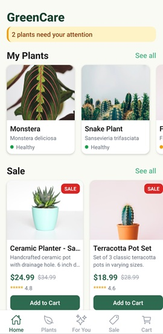
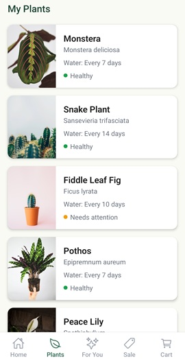
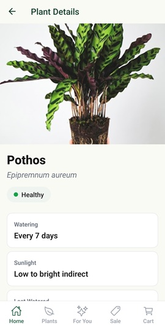
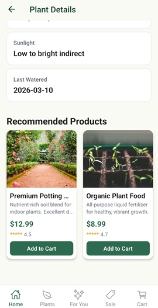
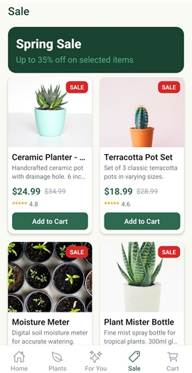
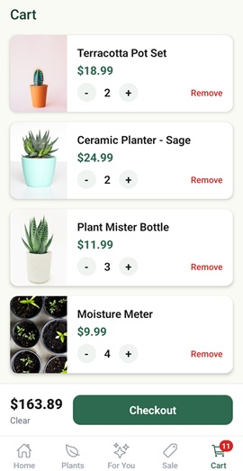
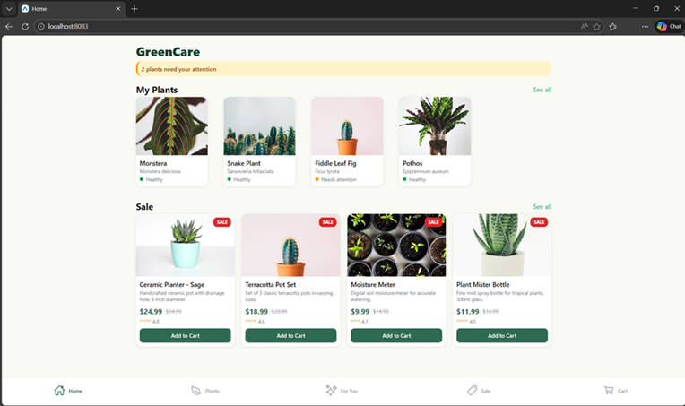

# GreenCare - Plant Care Assistant

A React Native mobile PoC application for a gardening brand. The app helps users manage their plants, get care recommendations, and shop for gardening products.

## About

GreenCare is a small, focused prototype demonstrating clean mobile architecture for the plants and gardening space. Users can track their plants' health, receive product recommendations, browse sale items, and manage a shopping cart.

### Key Features

- **Home** - Overview of user's plants and current sale items
- **My Plants** - Full list of user's plants with health status
- **Plant Detail** - Care instructions, watering schedule, and related product recommendations
- **For You** - Personalized product recommendations based on user's plants
- **Sale** - Discounted gardening products
- **Cart** - Add/remove products, adjust quantities, checkout flow

## Technologies

| Technology              | Purpose                                   |
| ----------------------- | ----------------------------------------- |
| **React Native** (0.83) | Cross-platform mobile framework           |
| **Expo** (SDK 55)       | Build tooling and development environment |
| **TypeScript** (5.9)    | Type-safe development                     |
| **React Navigation**    | Tab and stack navigation                  |
| **React Context**       | State management (Cart)                   |
| **React Native Web**    | Web platform support                      |

### Platform Support

- **Android** - Native APK build via Gradle
- **Web** - Responsive layout via Expo Web / React Native Web

## Screenshots

### Android

<!-- Add your Android screenshots here -->

| Home                                  | My Plants                                    | Plant Detail                                     |
| ------------------------------------- | -------------------------------------------- | ------------------------------------------------ |
|  |  |  |

| Recommendations                                             | Sale                                  | Cart                                  |
| ----------------------------------------------------------- | ------------------------------------- | ------------------------------------- |
|  |  |  |

### Web

<!-- Add your Web screenshots here -->

| Home                                  |
| ------------------------------------- |
|  |

## Project Structure (Clean Architecture)

```
src/
├── domain/                        # Business logic (no framework dependencies)
│   ├── entities/
│   │   ├── CartItem.ts            # Cart item model
│   │   ├── Plant.ts               # Plant entity
│   │   └── Product.ts             # Product entity
│   ├── repositories/
│   │   ├── PlantRepository.ts     # Plant repository interface
│   │   └── ProductRepository.ts   # Product repository interface
│   └── usecases/
│       ├── GetMyPlants.ts         # Fetch user's plants
│       ├── GetPlantDetail.ts      # Fetch single plant details
│       ├── GetRecommendations.ts  # Fetch recommended products
│       └── GetSaleProducts.ts     # Fetch sale products
│
├── data/                          # Data layer (implements domain interfaces)
│   ├── datasources/
│   │   ├── MockPlantData.ts       # Mock plant data
│   │   └── MockProductData.ts     # Mock product data
│   └── repositories/
│       ├── PlantRepositoryImpl.ts  # Plant repository implementation
│       └── ProductRepositoryImpl.ts# Product repository implementation
│
└── presentation/                  # UI layer
    ├── components/
    │   ├── PlantCard.tsx          # Reusable plant card
    │   ├── ProductCard.tsx        # Reusable product card with Add to Cart
    │   └── SectionHeader.tsx      # Section title with "See all" link
    ├── context/
    │   └── CartContext.tsx         # Cart state management (React Context + useReducer)
    ├── hooks/
    │   └── useResponsive.ts       # Responsive layout hook (mobile/tablet/web)
    ├── navigation/
    │   └── AppNavigator.tsx       # Tab + Stack navigation setup
    ├── screens/
    │   ├── HomeScreen.tsx         # Home with plant overview + sale preview
    │   ├── MyPlantsScreen.tsx     # Full plant list
    │   ├── PlantDetailScreen.tsx  # Plant details + care info + recommendations
    │   ├── RecommendationsScreen.tsx # Product grid for user
    │   ├── SaleScreen.tsx         # Sale products grid
    │   └── CartScreen.tsx         # Cart with quantity controls + checkout
    └── theme/
        ├── colors.ts              # Color palette
        └── spacing.ts             # Spacing and border radius constants
```

### Architecture Overview

- **Domain** layer defines entities and repository interfaces with no external dependencies
- **Data** layer implements repositories with mock data (swappable with real APIs)
- **Presentation** layer consumes use cases and renders UI
- Business logic is fully separated from UI framework code

## Getting Started

### Prerequisites

- Node.js 18+
- Android SDK (for APK build)
- Expo CLI

### Install Dependencies

```bash
npm install
```

### Run on Web

```bash
npx expo start --web
```

### Run on Android (Development)

```bash
npx expo start --android
```

### Build APK

```bash
npx expo prebuild --platform android
cd android
./gradlew assembleRelease
```

The APK will be at: `android/app/build/outputs/apk/release/app-release.apk`

## APK Download

The pre-built APK is available at:

[`release/GreenCare-v1.0.0.apk`](release/GreenCare-v1.0.0.apk)

Install on any Android device:

```bash
adb install GreenCare-v1.0.0.apk
```
